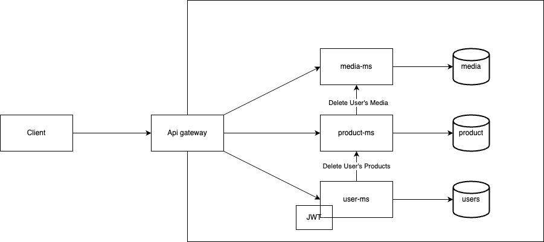

# E-Commerce Platform with Spring Boot and Angular

Welcome to our e-commerce platform, an end-to-end solution built with Spring Boot microservices for the backend and Angular for the frontend. This platform caters to both clients and sellers, offering user registration, authentication, and comprehensive product and media management.

## Features

- **User Registration**: Users can sign up as either clients or sellers.
- **Authentication**: Secure login system with role-based access control.
- **Product Management**: Sellers can create, read, update, and delete products.
- **Media Management**: Sellers can upload and manage product images with a 2MB size limit.
- **Frontend**: Angular-based user interfaces for registration, product listing, and media management.

## Getting Started

### Prerequisites

- Java JDK 17
- Maven
- Node.js and npm
- MongoDB
- Kafka

### Installation

1. Clone the repository:

   ```shell
   https://01.gritlab.ax/git/AntonW/buy-01.git
   ```

2. Navigate to the backend

   ```shell
   cd /backend
   ```

3. Start the docker

   ```shell
   docker-compose up --build
   ```

4. Navigato to <https://localhost:4200>

Done




https://documenter.getpostman.com/view/30164392/2s9YsJAXoQ